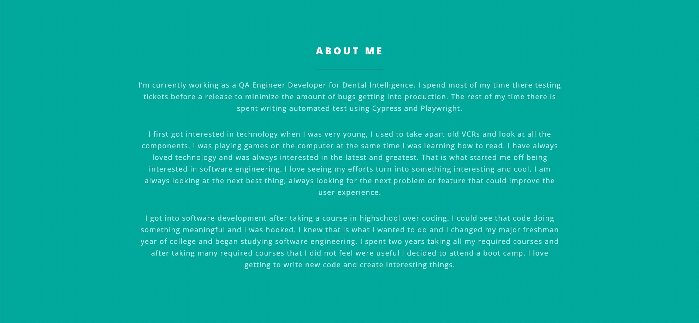
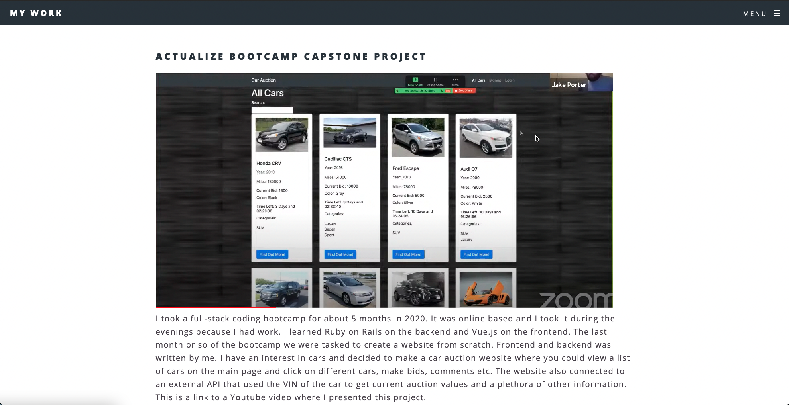

# Jake Porter Portfolio Page

## Main Page

## About Me

## My Work

## Deployed Website Link:

## https://jakemporter.github.io/

I created this portfolio webpage with a theme, I did use all my own images. I added some sections about myself along with an image of my wife and I. I linked in the nav bar a page about some things I have worked on including a bootcamp capstone project, work I've done professionally and projects I've done at Berkeley Bootcamp. I have also included some contact information at the bottom.

Spectral by HTML5 UP
html5up.net | @ajlkn
Free for personal and commercial use under the CCA 3.0 license (html5up.net/license)

Credits:

    Demo Images:
    	Unsplash (unsplash.com)

    Icons:
    	Font Awesome (fontawesome.io)

    Other:
    	jQuery (jquery.com)
    	Scrollex (github.com/ajlkn/jquery.scrollex)
    	Responsive Tools (github.com/ajlkn/responsive-tools)
